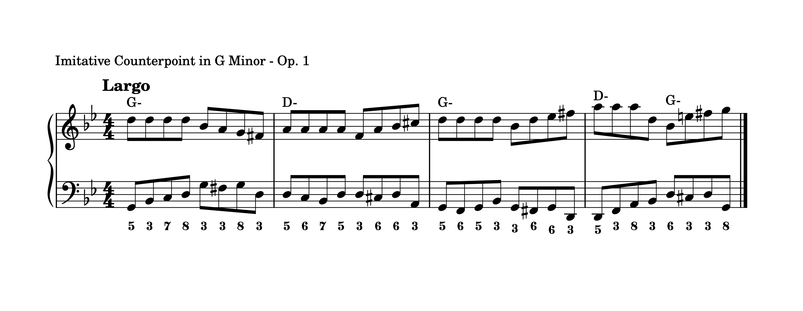

# Imitative Counterpoint in G Minor - Op. 1

The top voice states the theme in G Harmonic Minor: three repetitions of the fifth followed by a jump down to the root. The bottom voice responds with the answer: the root, a half-step down and back up, and a jump down by a fourth to the fifth. The statement and answer are transposed to D Harmonic Minor, the dominant key of G. With the statement and answer occurring at the same place in each measure as in the first measure. The variation comes with the octave that the themes are being play in. As well as the lines that connect the themes. 

> #### Themes
>
> - Three note repetition of the fifth and a jump down to the root.
> - Three note repetition of the root, interjected with a half-step down and back up, followed by a jump down to the fifth.
>
> The *root* and *fifth* make for a very strong **theme**.